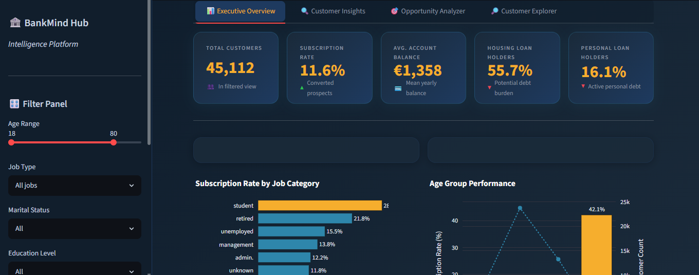
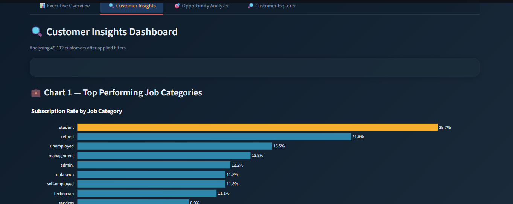
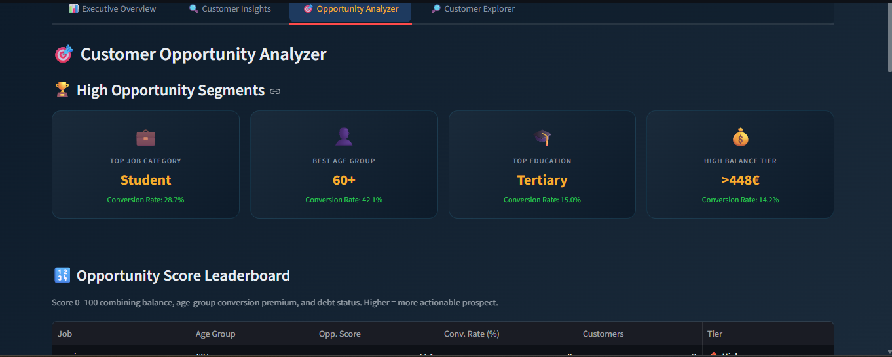
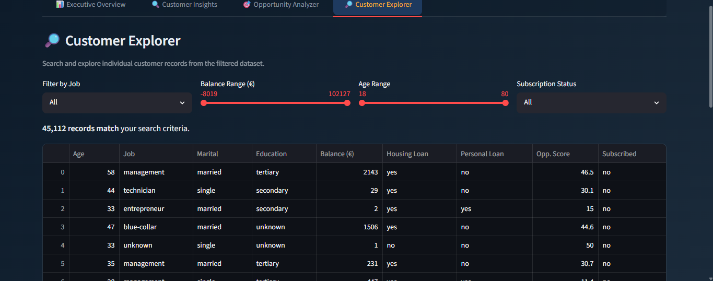

# 🏦 BankMind Intelligence Hub

**VITB AI Innovators Hub – Community Project Screening Task**
**Track A: Data Analyst**

## Live Demo

🔗 **https://bankmind.streamlit.app/**

---

## About the Project

This project was built as part of the VITB AI Innovators Hub screening process using the UCI Bank Marketing Dataset.

The objective was to analyze customer data from a banking marketing campaign and identify patterns that can help relationship managers understand which customer segments are more likely to subscribe to a financial product.

Rather than presenting the analysis through a notebook, I developed an interactive Streamlit dashboard that allows users to explore customer behavior, compare segments, and generate actionable insights through visual analytics.

The dashboard answers the four business questions specified in the task while also providing additional customer segmentation and recommendation features.

---

## Business Questions Addressed

The dashboard investigates the following questions:

1. Which job categories have the highest subscription rate?
2. Is there a relationship between account balance and subscription likelihood?
3. How do subscription rates differ across age groups?
4. Does having an existing housing loan affect the likelihood of subscribing to a new product?

---

## Features

### 📊 Executive Overview

Provides a high-level summary of the dataset through key performance indicators and visual summaries.

Includes:

* Total Customers
* Subscription Rate
* Average Account Balance
* Customers with Housing Loans
* Customers with Personal Loans
* Dynamic filtering support

---

### 📈 Customer Insights

Interactive visualizations built using Plotly.

Visualizations include:

* Subscription Rate by Job Category
* Account Balance vs Subscription Status
* Age Group Performance Analysis
* Housing Loan Impact Comparison

All charts automatically update when filters are applied.

---

### 🎯 Opportunity Analyzer

A custom Opportunity Score system was created to identify customer segments that appear more promising for future campaigns.

Features include:

* Opportunity Score Leaderboard
* Segment Ranking
* Customer Opportunity Analysis
* Data-Driven Recommendation Cards

---

### 🔎 Customer Explorer

Allows users to interact directly with the dataset.

Features:

* Search functionality
* Multi-column filtering
* Customer record exploration
* CSV export for filtered results

---

### 🎛 Interactive Filtering

Users can filter data using:

* Age Range
* Job Category
* Marital Status
* Education Level
* Housing Loan Status
* Personal Loan Status

All dashboard components respond dynamically to filter changes.

---

## Dashboard Screenshots

### Executive Overview



### Customer Insights



### Opportunity Analyzer



### Customer Explorer



---

## Project Structure

```text
bankmind-yashi/
│
├── app.py
├── utils.py
├── requirements.txt
├── README.md
├── EXPLANATION.md
│
├── assets/
│   ├── screenshot_overview.png
│   ├── screenshot_insights.png
│   ├── screenshot_analyzer.png
│   └── screenshot_explorer.png
│
└── data/
    └── bank-full.csv
```

---

## Dataset Information

Dataset: UCI Bank Marketing Dataset

Source:
https://archive.ics.uci.edu/dataset/222/bank+marketing

File Used:
`bank-full.csv`

Dataset Overview:

* Approximately 45,000 customer records
* Demographic information
* Financial information
* Existing product information
* Campaign outcomes

Target Variable:

`y`

* yes → Customer subscribed
* no → Customer did not subscribe

---

## Technologies Used

* Python
* Streamlit
* Pandas
* NumPy
* Plotly

---

## Running the Project Locally

### 1. Clone the Repository

```bash
git clone https://github.com/YOUR_USERNAME/bankmind-yashi.git
cd bankmind-yashi
```

### 2. Install Dependencies

```bash
pip install -r requirements.txt
```

### 3. Download the Dataset

Download the dataset from:

https://archive.ics.uci.edu/dataset/222/bank+marketing

Place `bank-full.csv` inside:

```text
data/
```

### 4. Run the Application

```bash
python -m streamlit run app.py
```

The application will be available at:

```text
http://localhost:8501
```

---

## Key Learnings

Through this project I gained experience in:

* Exploratory Data Analysis
* Customer Segmentation
* Business-Oriented Data Visualization
* Dashboard Development with Streamlit
* Interactive Filtering and Reporting
* Translating data insights into actionable recommendations

---

## Future Improvements

Potential enhancements include:

* Machine Learning-based subscription prediction
* Customer propensity scoring
* Automated recommendation generation using LLMs
* Real-time campaign monitoring dashboard
* Advanced customer clustering techniques

---

## Submission Notes

This repository contains:

* Source code
* Dashboard implementation
* Documentation
* EXPLANATION.md answers required for the screening task

Built for the VITB AI Innovators Hub Community Project Screening Task (Track A).
